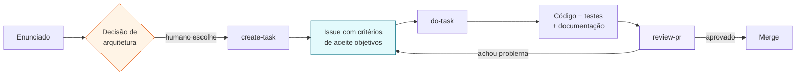

# Uso de inteligência artificial neste projeto

O desafio pede que o uso de IA, havendo, seja **estruturado**. Foi, e este
documento descreve como.

A premissa: IA acelera a produção de texto e de código, mas não assume
responsabilidade por decisão de arquitetura nem por afirmação técnica. Toda
decisão registrada em [`docs/adr/`](docs/adr/) foi tomada com alternativas
explícitas na mesa, e tudo o que este repositório afirma que funciona foi
executado e conferido.

**Ferramenta:** Claude Code (modelos Fable 5.1 e Opus 5), operando no
repositório com acesso ao terminal, ao sistema de arquivos e à API do GitHub.

---

## O ciclo de trabalho

O projeto não foi escrito em uma conversa longa pedindo código. Ele roda em um
ciclo fechado, com um artefato verificável em cada etapa.

O ponto do ciclo é que **nenhuma etapa confia na anterior**. A issue não confia
na leitura do enunciado, porque tem critérios de aceite que alguém pode
conferir. A implementação não confia na issue, porque roda os testes. A revisão
não confia na implementação, porque reconstrói o fluxo a partir da especificação
e do código, e não da justificativa de quem escreveu.

## As skills versionadas

O diretório [`.claude/`](.claude/) está no repositório de propósito: as regras de
cada etapa fazem parte do processo de engenharia, não do ambiente pessoal de quem
escreveu.

| Skill         | O que faz                                                                                                                                                                      |
| ------------- | ------------------------------------------------------------------------------------------------------------------------------------------------------------------------------ |
| `create-task` | Investiga o código antes de abrir a issue e exige seções fixas: fluxo atual, causa raiz, solução, critérios de aceite, riscos e arquivos analisados.                           |
| `do-task`     | Busca a issue, confirma o escopo, implementa, atualiza a documentação afetada e mantém issue e cartão do quadro sincronizados.                                                 |
| `review-pr`   | Revisa como engenheiro externo que **não** implementou a mudança. Reconstrói o fluxo de fora para dentro e classifica cada achado por severidade, confiança e raio de impacto. |
| `grill-me`    | Interroga o plano decisão por decisão, uma pergunta por vez, até não restar ramo em aberto.                                                                                    |

Duas regras atravessam todas elas, e existem para conter os modos de falha
típicos de IA. **Separar fato de hipótese:** uma afirmação sobre o código precisa
dizer se foi confirmada em arquivo ou se é suposição. **Listar os arquivos
analisados:** quando a resposta é "nenhum, o repositório está vazio", isso é
dito, em vez de citar caminhos plausíveis.

---

## Onde a decisão foi humana

A IA entregou volume e consistência. O julgamento ficou nos pontos com mais de
uma resposta defensável, cada um decidido com os trade-offs na mesa e registrado
no ADR correspondente:

- **Lambda com API Gateway** em vez de ECS Fargate ([ADR 0008](docs/adr/0008-lambda-em-vez-de-fargate.md)).
- **Fastify com zod** em vez de Express ou NestJS ([ADR 0002](docs/adr/0002-fastify-e-zod.md)).
- **Login com refresh token rotativo**, em vez de apenas access token ([ADR 0006](docs/adr/0006-jwt-e-refresh-token.md)).
- **Node 24 LTS**, após verificar o suporte do ferramental e do runtime da AWS.
- **Submeter o plano a uma revisão adversarial** antes de escrever código.

---

## A revisão do plano, antes da primeira linha de código

O plano completo foi submetido a uma revisão feita da perspectiva de quem avalia,
com a pergunta explícita: _o que reprovaria isto?_

Ela encontrou oito problemas — três deles de segurança — e todos foram corrigidos
nas issues **antes** que qualquer código fosse escrito. Corrigir na especificação
custa uma edição de texto; corrigir depois custa refatoração e, no caso dos três
primeiros, um incidente.

| Problema                                                                | Consequência se tivesse passado                                                       |
| ----------------------------------------------------------------------- | ------------------------------------------------------------------------------------- |
| Bloqueio de conta respondia diferente de senha errada                   | Permitiria enumerar quais e-mails existem e bloquear contas de terceiros de propósito |
| Contador de tentativas de login sem proteção contra escrita concorrente | Duas tentativas simultâneas sobrescreveriam o contador e anulariam o bloqueio         |
| Senha sem limite de tamanho                                             | Um corpo de 64 KB seria processado inteiro pelo argon2id                              |
| Política de IAM sem `DescribeTable`                                     | A verificação de prontidão falharia em produção, e somente lá                         |
| Segredos lidos do Parameter Store a cada requisição                     | A latência do SSM entraria no p99 de toda chamada                                     |
| Script de carga inicial só funcionava contra o banco local              | O avaliador subiria a infraestrutura e encontraria uma API sem nenhum dado            |
| Rotas sem prefixo de versão                                             | Adicionar versão depois recairia sobre todos os consumidores                          |
| Erro de rate limit declarado no domínio                                 | Rate limit é preocupação de aplicação, não regra de negócio                           |

O histórico de edição das issues no GitHub mostra cada uma dessas correções.

---

## Verificação

Nada neste repositório é afirmado com base em plausibilidade. O que a IA propõe é
tratado como hipótese até ser executado.

**O ferramental foi conferido no registro de pacotes, não presumido.** A proposta
inicial usava a versão mais recente de cada dependência. Ao verificar, o
`typescript-eslint` declara suporte apenas até o TypeScript 6 — a versão 7 quebraria
o lint com verificação de tipos. Foi fixado o TypeScript 5.9. Versão publicada não
é prova de compatibilidade.

**A regra de fronteira arquitetural foi testada com arquivos que a violam.** Lint
verde não prova que a regra funciona, apenas que nada disparou. A validação usou
cinco cenários — núcleo importando infraestrutura, núcleo importando pacote de
terceiros, núcleo usando módulo nativo do Node e adaptador importando domínio e
pacote externo — e as sondas foram removidas em seguida. A primeira configuração
passava sem erro e não estava funcionando.

**A cadeia completa roda em instalação limpa,** com o código de saída conferido
individualmente: `npm ci`, `npm run typecheck`, `npm run lint`,
`npm run format:check`, `npm test`, `npm run test:coverage` e `npm run build`.

**A documentação não descreve como pronto o que não está.** O
[README](README.md) traz uma tabela de status por issue, e onde há intenção ela
está marcada como tal.

## Limites conhecidos

O que estiver marcado como pendente no README não foi implementado nem testado.
Números de desempenho, cold start e cobertura só aparecem nesta documentação
depois de medidos, nunca estimados.
