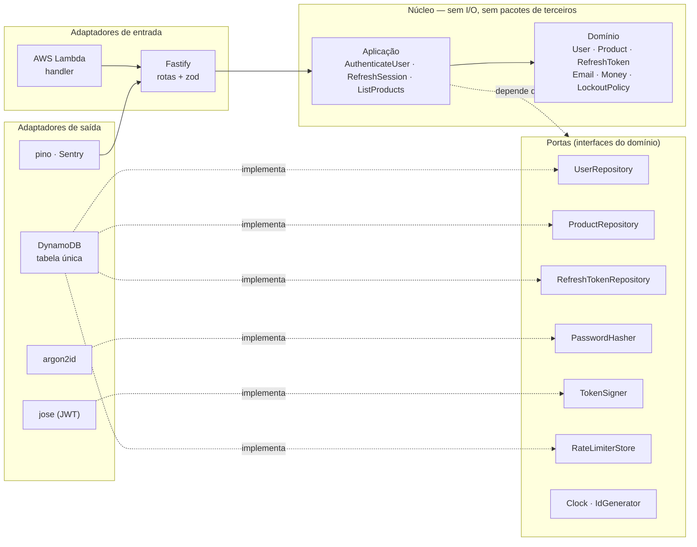
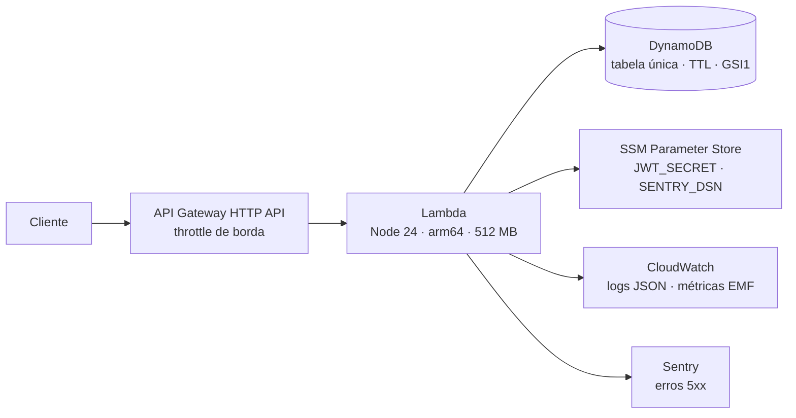

# Ton SWE Challenge — API de autenticação e catálogo

API REST que autentica usuários por JWT e expõe uma listagem de produtos
protegida, paginada por cursor e com rate limit. Construída em arquitetura
hexagonal sobre Node.js e TypeScript, persistida em DynamoDB e provisionada com
Terraform.

Resposta ao desafio técnico back-end da Ton/Stone.

---

## Status da implementação

O trabalho está fatiado em issues, cada uma com escopo, critérios de aceite e
riscos. Esta tabela é a fonte de verdade sobre o que já roda.

| #                                                                         | Entrega                                      | Status      |
| ------------------------------------------------------------------------- | -------------------------------------------- | ----------- |
| [1](https://github.com/Eduardobl123/ton-swe-challenge-eduardo/issues/1)   | Bootstrap, tooling e fronteiras hexagonais   | ✅ pronto   |
| [2](https://github.com/Eduardobl123/ton-swe-challenge-eduardo/issues/2)   | Domínio: entidades, value objects e portas   | ✅ pronto   |
| [3](https://github.com/Eduardobl123/ton-swe-challenge-eduardo/issues/3)   | Login com argon2id, JWT e lockout            | ✅ pronto   |
| [4](https://github.com/Eduardobl123/ton-swe-challenge-eduardo/issues/4)   | Refresh token rotativo com detecção de reuso | ✅ pronto   |
| [5](https://github.com/Eduardobl123/ton-swe-challenge-eduardo/issues/5)   | Listagem paginada por cursor                 | ✅ pronto   |
| [6](https://github.com/Eduardobl123/ton-swe-challenge-eduardo/issues/6)   | Rate limit por usuário e por IP              | ✅ pronto   |
| [7](https://github.com/Eduardobl123/ton-swe-challenge-eduardo/issues/7)   | Persistência DynamoDB e ambiente local       | ⏳ pendente |
| [8](https://github.com/Eduardobl123/ton-swe-challenge-eduardo/issues/8)   | Adaptador HTTP Fastify e OpenAPI             | ⏳ pendente |
| [9](https://github.com/Eduardobl123/ton-swe-challenge-eduardo/issues/9)   | Observabilidade: logs, request-id e Sentry   | ⏳ pendente |
| [10](https://github.com/Eduardobl123/ton-swe-challenge-eduardo/issues/10) | Infraestrutura AWS com Terraform             | ⏳ pendente |
| [11](https://github.com/Eduardobl123/ton-swe-challenge-eduardo/issues/11) | CI/CD e gate de cobertura                    | ⏳ pendente |
| [12](https://github.com/Eduardobl123/ton-swe-challenge-eduardo/issues/12) | Documentação, ADRs e diagramas               | 🔄 em curso |
| [13](https://github.com/Eduardobl123/ton-swe-challenge-eduardo/issues/13) | Testes ponta a ponta e contrato              | ⏳ pendente |

---

## Arquitetura

O domínio fica no centro e não conhece nada externo. Casos de uso o orquestram
através de **portas** — interfaces declaradas pelo próprio domínio. Adaptadores
implementam essas portas com tecnologia concreta. Trocar DynamoDB por Postgres,
ou Fastify por Express, não toca em uma linha de regra de negócio.



A regra de dependência é verificada por lint, não por disciplina:
`npm run lint` falha se `domain/` ou `application/` importarem de
`infrastructure/` ou de qualquer pacote de terceiros.

Detalhes em [`src/README.md`](src/README.md). Diagramas de fluxo em
[`docs/diagrams/`](docs/diagrams/).

### Infraestrutura alvo



---

## Como rodar localmente

Pré-requisitos: **Node 24** (`nvm use` lê o `.nvmrc`) e Docker, este último a
partir da issue #7.

```bash
git clone https://github.com/Eduardobl123/ton-swe-challenge-eduardo.git
cd ton-swe-challenge-eduardo

nvm use              # Node 24.20.0
npm ci               # instala e prepara os hooks de commit
cp .env.example .env # ajuste o JWT_SECRET antes de subir

npm run dev          # valida a configuração e sobe o servidor
```

O `npm run dev` de hoje valida o `.env` e descreve a configuração resolvida. Se
faltar uma variável ou o `JWT_SECRET` for curto demais, ele lista tudo que
precisa ser corrigido e encerra. O servidor HTTP entra em serviço na issue #8.

Gere um segredo real com:

```bash
openssl rand -base64 48
```

### Fluxo completo (a partir das issues #7 e #8)

```bash
docker compose up -d      # DynamoDB Local
npm run db:seed           # usuário demo + 250 produtos
npm run dev

# login
curl -s -X POST http://localhost:3000/v1/auth/login \
  -H 'content-type: application/json' \
  -d '{"email":"demo@ton.com.br","password":"Desafio@Ton2026"}'

# listagem protegida e paginada
curl -s 'http://localhost:3000/v1/products?limit=20' \
  -H "authorization: Bearer $ACCESS_TOKEN"
```

Documentação interativa em `http://localhost:3000/docs`.

---

## Variáveis de ambiente

Todas são validadas na subida por [`src/infrastructure/config/env.ts`](src/infrastructure/config/env.ts).
A aplicação recusa iniciar com configuração inválida, em vez de falhar na
primeira requisição. A referência completa e comentada está em
[`.env.example`](.env.example).

| Variável                         | Obrigatória | Padrão                  | Para que serve                                      |
| -------------------------------- | ----------- | ----------------------- | --------------------------------------------------- |
| `NODE_ENV`                       | não         | `development`           | Formato de log e exposição do Swagger               |
| `PORT`                           | não         | `3000`                  | Porta HTTP local                                    |
| `LOG_LEVEL`                      | não         | `info`                  | Nível mínimo de log                                 |
| `APP_VERSION`                    | não         | `local`                 | Versão nos logs e no Sentry (SHA do commit no CI)   |
| `JWT_SECRET`                     | **sim**     | —                       | Segredo HMAC, mínimo de 32 caracteres               |
| `JWT_ISSUER`                     | não         | `ton-swe-challenge`     | Claim `iss`, validada na verificação                |
| `JWT_AUDIENCE`                   | não         | `ton-swe-challenge-api` | Claim `aud`, validada na verificação                |
| `JWT_ACCESS_TTL_SECONDS`         | não         | `900`                   | Validade do access token                            |
| `REFRESH_TOKEN_TTL_SECONDS`      | não         | `604800`                | Validade do refresh token                           |
| `LOCKOUT_MAX_ATTEMPTS`           | não         | `5`                     | Tentativas erradas antes do bloqueio                |
| `LOCKOUT_BASE_DELAY_MS`          | não         | `30000`                 | Primeiro bloqueio, com backoff exponencial          |
| `LOCKOUT_MAX_DELAY_MS`           | não         | `900000`                | Teto do bloqueio, para não virar negação de serviço |
| `AWS_REGION`                     | não         | `us-east-1`             | Região do DynamoDB                                  |
| `TABLE_NAME`                     | **sim**     | —                       | Tabela única do DynamoDB                            |
| `DYNAMODB_ENDPOINT`              | não         | —                       | Aponta para o DynamoDB Local; vazio usa a AWS real  |
| `RATE_LIMIT_PRODUCTS_PER_MINUTE` | não         | `60`                    | Cota por usuário na listagem                        |
| `RATE_LIMIT_LOGIN_PER_MINUTE`    | não         | `10`                    | Cota por IP no login                                |
| `RATE_LIMIT_REFRESH_PER_MINUTE`  | não         | `20`                    | Cota por IP na renovação de sessão                  |
| `RATE_LIMIT_FAIL_OPEN`           | não         | `true`                  | Se o contador falhar, libera em vez de recusar      |
| `CORS_ORIGINS`                   | não         | `*`                     | Origens permitidas, separadas por vírgula           |
| `SWAGGER_ENABLED`                | não         | `true`                  | Expõe `/docs`                                       |
| `SENTRY_DSN`                     | não         | —                       | Vazio desliga o Sentry                              |
| `SENTRY_TRACES_SAMPLE_RATE`      | não         | `0.1`                   | Fração de transações rastreadas                     |

---

## Testes

```bash
npm test              # unitários — rápidos, sem Docker
npm run test:coverage # unitários com relatório de cobertura
npm run test:integration  # contra o DynamoDB Local (issue #7)
npm run test:e2e          # jornadas completas (issue #13)
```

A pirâmide é deliberada. O núcleo tem gate de cobertura de 90% porque é código
puro, sem I/O, onde não existe desculpa para não cobrir. Adaptadores ficam com
os testes de integração, e as jornadas de ponta a ponta cobrem a composição.

Relatório HTML em `coverage/index.html` após `npm run test:coverage`.

---

## Qualidade de código

```bash
npm run typecheck   # tsc em modo strict
npm run lint        # ESLint, incluindo as fronteiras arquiteturais
npm run format      # Prettier
```

O TypeScript roda com `strict`, `noUncheckedIndexedAccess` e
`exactOptionalPropertyTypes`. O ESLint bloqueia promessas não tratadas e
importações que quebrem a direção da dependência entre camadas. Um hook de
pre-commit roda lint e formatação apenas nos arquivos alterados.

---

## Observabilidade

Cada requisição recebe ou propaga um `x-request-id`. O mesmo identificador
aparece no log estruturado, no corpo do erro devolvido ao cliente e no evento
enviado ao Sentry, o que permite seguir uma requisição da resposta até a causa.
Logs saem em JSON de uma linha, com senha, hash e token removidos por
configuração de redaction. Detalhes na issue #9.

---

## Deploy na AWS

API Gateway HTTP API à frente de uma função Lambda em arm64, com DynamoDB como
banco e segredos no SSM Parameter Store. Tudo provisionado por Terraform, com
IAM de menor privilégio. Passo a passo em [`infra/README.md`](infra/) a partir
da issue #10.

---

## Decisões técnicas

As escolhas relevantes estão registradas como ADRs em [`docs/adr/`](docs/adr/),
cada uma com contexto, alternativas descartadas e consequências. Os códigos de
erro e quais deles nunca chegam ao cliente estão em
[`docs/errors.md`](docs/errors.md).

| ADR                                                 | Decisão                                                  |
| --------------------------------------------------- | -------------------------------------------------------- |
| [0001](docs/adr/0001-arquitetura-hexagonal.md)      | Arquitetura hexagonal com composition root manual        |
| [0002](docs/adr/0002-fastify-e-zod.md)              | Fastify com zod como fonte única de validação e OpenAPI  |
| [0003](docs/adr/0003-dynamodb-tabela-unica.md)      | DynamoDB em tabela única                                 |
| [0004](docs/adr/0004-paginacao-por-cursor.md)       | Paginação por cursor, sem contagem total                 |
| [0005](docs/adr/0005-rate-limit-em-duas-camadas.md) | Rate limit em duas camadas, janela deslizante, fail-open |
| [0006](docs/adr/0006-jwt-e-refresh-token.md)        | JWT curto com refresh rotativo e detecção de reuso       |
| [0007](docs/adr/0007-argon2id.md)                   | argon2id para hash de senha                              |
| [0008](docs/adr/0008-lambda-em-vez-de-fargate.md)   | Lambda com API Gateway em vez de ECS Fargate             |
| [0009](docs/adr/0009-observabilidade.md)            | pino, Sentry e métricas EMF                              |
| [0010](docs/adr/0010-lockout-indistinguivel.md)     | Bloqueio de conta indistinguível de credencial inválida  |
| [0011](docs/adr/0011-versionamento-da-api.md)       | Versionamento da API por prefixo `/v1`                   |

---

## Uso de inteligência artificial

O desafio pede que o uso de IA, se houver, seja estruturado. Ele foi, e o
processo está descrito em [`AI_USAGE.md`](AI_USAGE.md): planejamento em issues
com critérios de aceite, skills versionadas em `.claude/`, revisão adversarial
do próprio plano e o que foi rejeitado e por quê.

---

## Roadmap

O que faria com mais tempo, em ordem de valor:

1. **Trocar o rate limit para Redis.** Uma escrita no DynamoDB por requisição
   funciona e é atômica, mas custa mais que o necessário em volume alto.
2. **Migrar o JWT para ES256 com JWKS.** O HS256 exige compartilhar o segredo
   com todo verificador; chave assimétrica permite validar sem poder assinar.
3. **Sharding da partição de produtos ativos.** O `GSI1PK` único vira ponto
   quente se o catálogo crescer muito.
4. **Testes de mutação** com Stryker no núcleo, para medir a qualidade dos
   testes e não apenas a cobertura.
5. **Cache de leitura** na listagem, com invalidação por escrita.

---

## Licença

[MIT](LICENSE).
