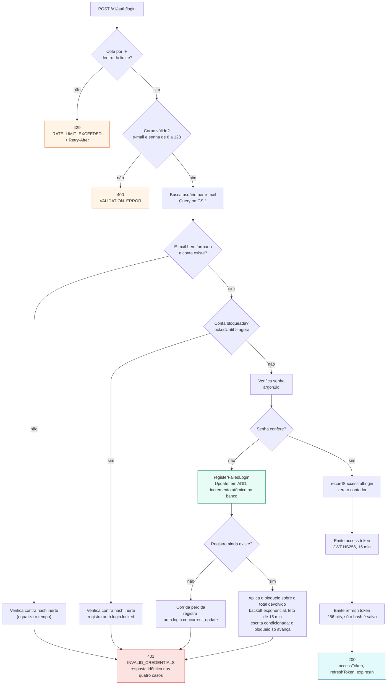

# Fluxo de login

O ponto central deste diagrama é que **quatro caminhos diferentes terminam na
mesma resposta**: e-mail malformado, e-mail inexistente, senha errada e conta
bloqueada produzem um `401 INVALID_CREDENTIALS` idêntico, com o mesmo corpo e o
mesmo tempo de resposta.

Isso é deliberado. Uma resposta distinta para conta bloqueada permitiria
descobrir quais e-mails existem, e permitiria bloquear a conta de terceiros de
propósito. O raciocínio completo está no [ADR 0010](../adr/0010-lockout-indistinguivel.md).

A verificação contra um hash inerte quando o usuário não existe serve ao mesmo
propósito no eixo do tempo: sem ela, a resposta mais rápida denunciaria que o
e-mail não está cadastrado.

O contador de tentativas é incrementado **pelo banco**, e não lido e regravado
pela aplicação. É um dos dois detalhes que fazem o bloqueio valer contra ataque
automatizado, e está destacado no diagrama porque a forma intuitiva de escrevê-lo
é a errada. O outro é a escrita do bloqueio ser condicionada ao valor vigente,
de modo que ele só avança — sem isso, atacar em paralelo o encurtava.

## Por que o incremento é do banco

Contar do lado da aplicação exigiria ler o total, somar um e gravar de volta.
Entre a leitura e a escrita cabe outra tentativa, que leu o mesmo total e grava
por cima. Vinte tentativas simultâneas terminavam com o contador em 1 e a conta
destravada: o bloqueio existia e não bloqueava.

A operação `ADD` do DynamoDB resolve isso porque soma no próprio item, sem
leitura prévia, e devolve o total já atualizado. O bloqueio é decidido sobre
esse total. A condição `attribute_exists(pk)` acompanha a escrita porque, sem
ela, o `ADD` **criaria** o item ausente e deixaria um registro parcial
permanente no banco.

Quando a condição falha, o registro sumiu no meio do fluxo. A requisição termina
no mesmo 401 das demais, e a anomalia fica só no log: transformá-la em erro
interno diria a quem sonda que ali aconteceu algo diferente.

## Por que o bloqueio só avança

Contar e bloquear são duas escritas, e o DynamoDB não ordena escritas
independentes. Duas tentativas simultâneas que cruzam o limiar calculam durações
diferentes — a que conta cinco falhas pede 30s, a que conta seis pede 60s — e a
que calculou o menor pode chegar por último.

Por isso a segunda escrita é condicionada também ao valor atual de `lockedUntil`,
e não apenas à existência do registro: o instante de expiração nunca retrocede, e
o resultado independe da ordem de chegada. Sem essa condição, bastava disparar
tentativas em paralelo para manter a punição no mínimo. A comparação é
lexicográfica, o que só é válido porque a data é gravada em ISO-8601 — largura
fixa, sempre em UTC. Ver [ADR 0010](../adr/0010-lockout-indistinguivel.md).

O caso de vinte tentativas em paralelo está fixado em teste ponta a ponta, e a
regressão foi verificada trocando o incremento atômico de volta pela leitura
seguida de escrita.

## O que sai para o painel

A borda registra `LoginSuccess` ou `LoginFailure` a partir do status, contando
apenas `200` e `401`. Corpo malformado não é tentativa de credencial, e
requisição barrada pela cota já entra em `RateLimited`. Somar as duas faria um
cliente com bug de serialização elevar o indicador de ataque.

A senha acima de 128 caracteres é recusada pelo schema, antes de chegar ao caso
de uso, e vira `400`. O caso de uso repete o limite por conta própria: ele é
chamado por testes e poderia ser chamado por outra borda no futuro, e derivar
argon2 sobre entrada absurda é exatamente o custo que se quer evitar.
