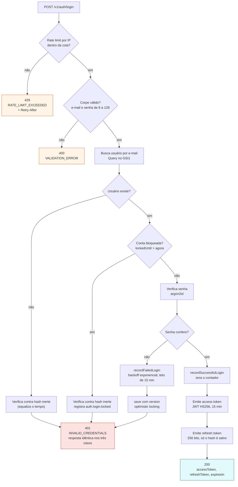

# Fluxo de login

O ponto central deste diagrama é que **três caminhos diferentes terminam na
mesma resposta**: e-mail inexistente, senha errada e conta bloqueada produzem um
`401 INVALID_CREDENTIALS` idêntico, com o mesmo corpo e o mesmo tempo de
resposta.

Isso é deliberado. Uma resposta distinta para conta bloqueada permitiria
descobrir quais e-mails existem, e permitiria bloquear a conta de terceiros de
propósito. O raciocínio completo está no [ADR 0010](../adr/0010-lockout-indistinguivel.md).

A verificação contra um hash inerte quando o usuário não existe serve ao mesmo
propósito no eixo do tempo: sem ela, a resposta mais rápida denunciaria que o
e-mail não está cadastrado.

