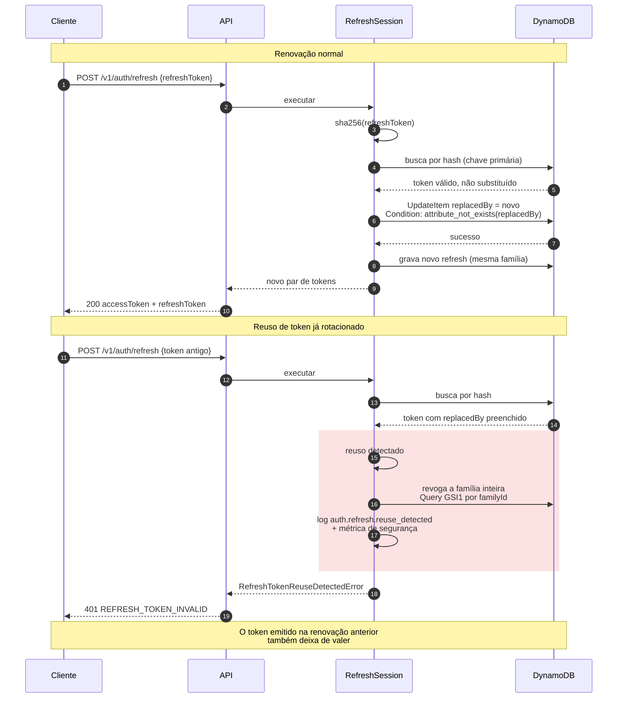

# Renovação de sessão e detecção de reuso

O refresh token é rotacionado a cada uso: o antigo é marcado como substituído e
um novo par é emitido. Isso transforma o **reuso** de um token já gasto em um
sinal claro de que existe uma cópia circulando.

Quando esse sinal aparece, a resposta não é apenas recusar a requisição. Toda a
família de tokens daquela sessão é revogada, o que derruba tanto o atacante
quanto o token legítimo. É agressivo de propósito: entre manter uma sessão
possivelmente comprometida e forçar uma nova autenticação, a segunda opção é a
correta. Ver [ADR 0006](../adr/0006-jwt-e-refresh-token.md).

