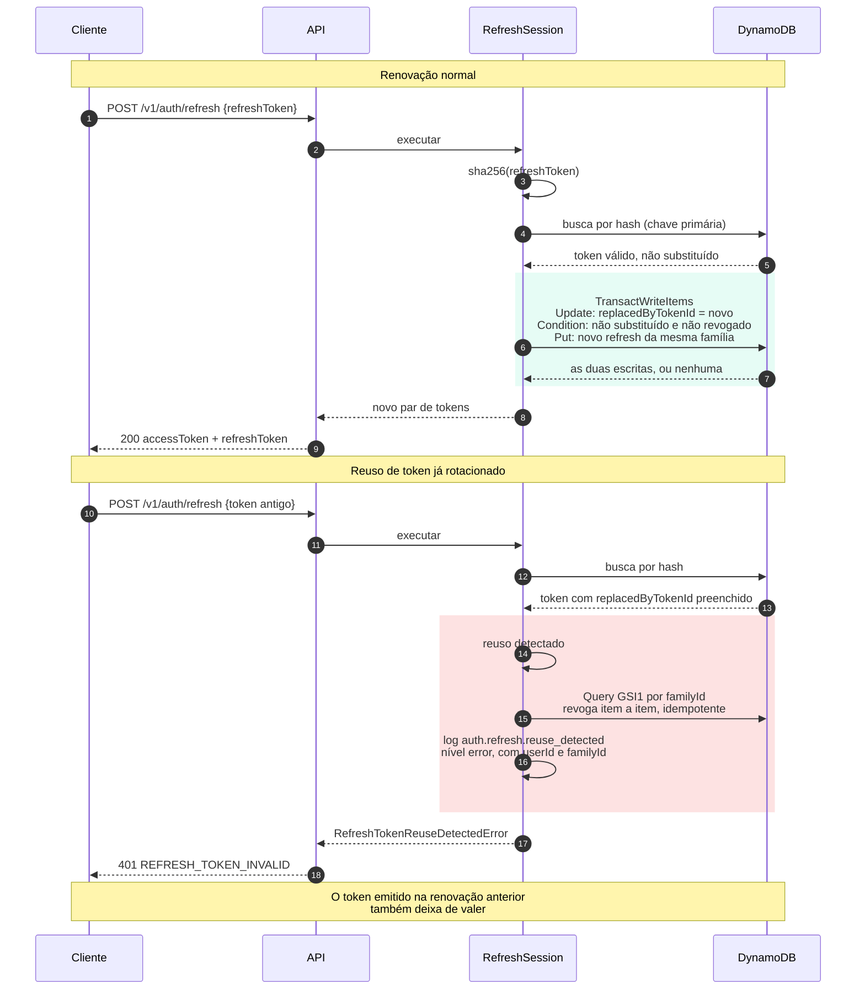

# Renovação de sessão e detecção de reuso

O refresh token é rotacionado a cada uso: o antigo é marcado como substituído e
um novo par é emitido. Isso transforma o **reuso** de um token já gasto em um
sinal claro de que existe uma cópia circulando.

Quando esse sinal aparece, a resposta não é apenas recusar a requisição. Toda a
família de tokens daquela sessão é revogada, o que derruba tanto o atacante
quanto o token legítimo. É agressivo de propósito: entre manter uma sessão
possivelmente comprometida e forçar uma nova autenticação, a segunda opção é a
correta. Ver [ADR 0006](../adr/0006-jwt-e-refresh-token.md).

Para quem chama, porém, o reuso é indistinguível de um token qualquer que não
vale: a resposta é sempre `401 REFRESH_TOKEN_INVALID`. Avisar que o reuso foi
percebido só ensinaria a quem ataca que a cópia foi notada.

## Por que a rotação é uma transação só

As duas escritas precisam acontecer juntas. Marcar o token antigo e falhar ao
gravar o novo deixaria a sessão sem credencial de renovação nenhuma, e a pessoa
seria deslogada em silêncio, sem erro visível em lugar nenhum. Gravar o novo
antes de marcar o antigo deixaria os dois válidos ao mesmo tempo, que é
exatamente o que a rotação existe para impedir.

A condição da transação também resolve a corrida: duas renovações simultâneas
com o mesmo token disputam a marcação, e só uma vence. Quem perde recebe falha
de condição, indistinguível de reuso, e é tratada como tal. Deixar passar
permitiria que duas partes seguissem com sessões válidas derivadas da mesma
credencial.

## Revogar a família não é transação

A varredura usa o índice da família e revoga item a item. Uma transação cobriria
no máximo cem itens e falharia inteira se um deles conflitasse. Aqui o que
importa é que todos acabem revogados, e revogar duas vezes é inofensivo.

A revogação só dispara enquanto a família ainda estiver viva. Quem insiste com
um token roubado depois que a sessão já caiu não deve conseguir provocar uma
varredura a cada tentativa, que seria carga barata de gerar no banco. O log,
esse sim, se repete: cada tentativa é um dado sobre o ataque em curso.

## O que existe para observar

Só a linha de log `auth.refresh.reuse_detected`, em nível de erro, com o usuário
e a família. **Não existe métrica dedicada de segurança** neste caminho: as
métricas publicadas hoje são `RequestDuration`, `RateLimited`, `ServerError`,
`LoginSuccess` e `LoginFailure`. Um alarme sobre reuso precisa ser montado sobre
o log, e não sobre uma métrica.

## Logout não é reuso

Encerrar sessão revoga a família sem rotacionar nada. O reuso é decidido apenas
por `replacedByTokenId` preenchido, e não por token revogado, justamente para
que o logout do dia a dia não dispare o alerta de segurança até ninguém mais
olhar para ele. Quem apresenta um token de sessão encerrada recebe o mesmo
`401`, com o motivo `session_ended` no log.
