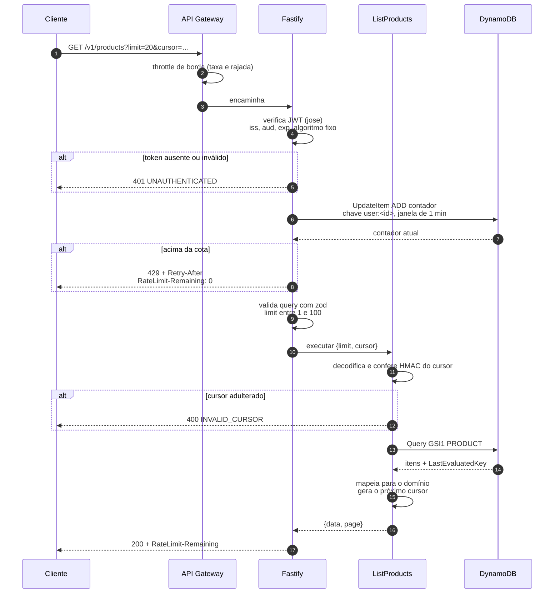

# Listagem de produtos

A rota protegida junta três mecanismos: verificação do token sem tocar no banco,
cota por usuário autenticado e paginação por cursor.

A ordem importa. O token é verificado **antes** do rate limit, porque a chave da
cota é o identificador do usuário — limitar por endereço numa rota autenticada
puniria todos os clientes atrás de um mesmo NAT. Ver
[ADR 0005](../adr/0005-rate-limit-em-duas-camadas.md).

O cursor é opaco e assinado. O cliente o devolve como recebeu, sem saber que
dentro dele está a chave de continuação do DynamoDB. Ver
[ADR 0004](../adr/0004-paginacao-por-cursor.md).

