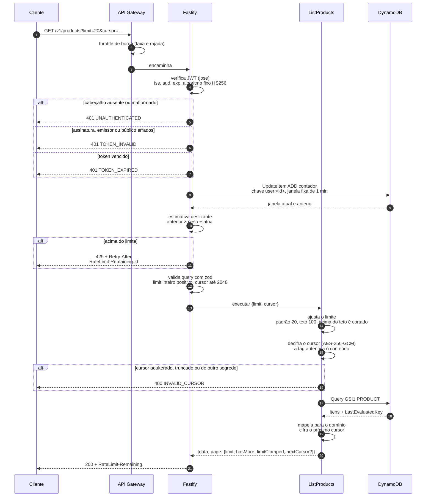

# Listagem de produtos

A rota protegida junta três mecanismos: verificação do token sem tocar no banco,
cota por usuário autenticado e paginação por cursor.

A ordem importa. O token é verificado **antes** do rate limit, porque a chave da
cota é o identificador do usuário. Limitar por endereço numa rota autenticada
puniria todos os clientes atrás de um mesmo NAT. Ver
[ADR 0005](../adr/0005-rate-limit-em-duas-camadas.md).

O cursor é **cifrado**, não apenas assinado. O cliente o devolve como recebeu e
não tem como ler o que há dentro. Ver
[ADR 0004](../adr/0004-paginacao-por-cursor.md).

## O limite é ajustado, não recusado

O schema exige apenas inteiro positivo. O teto de 100 é aplicado depois, no caso
de uso, e a resposta informa em `page.limitClamped` que o pedido foi cortado.

Pedir `limit=500` devolve `200` com 100 itens e `limitClamped: true`, e não um
`400`. A escolha evita que um cliente que pediu demais quebre em vez de receber
o que a API está disposta a entregar, e o sinalizador impede que ele conclua que
só existem 100 produtos.

## O cursor é cifrado, e por quê

Dentro dele está a chave de continuação do DynamoDB, que é uma chave interna do
banco. Assinar bastaria para impedir adulteração, mas deixaria o conteúdo
legível, e a estrutura da tabela viraria parte do contrato público sem ninguém
decidir isso.

O formato é `AES-256-GCM`, com vetor de inicialização aleatório de 12 bytes por
cursor e a tag de autenticação de 16 bytes junto. A chave é derivada do segredo
da aplicação com um domínio próprio, `page-cursor:`, para que o mesmo segredo
usado em outro lugar não produza a mesma chave.

A tag do GCM é o que autentica: cursor adulterado, truncado ou emitido sob outro
segredo falha na verificação e vira `400 INVALID_CURSOR`. Não existe caminho em
que um cursor forjado chegue a virar consulta no banco.

## A janela da cota desliza

O contador não é uma janela fixa de um minuto. São duas janelas fixas, e a
estimativa pondera a anterior pelo quanto ainda falta da atual. Uma janela fixa
pura aceitaria o dobro do limite na virada, metade no fim de uma e metade no
começo da seguinte.

É por isso que o `Retry-After` de quem estourou a cota pode passar de 60
segundos: o peso da janela anterior precisa decair antes de a estimativa cair
abaixo do limite.
