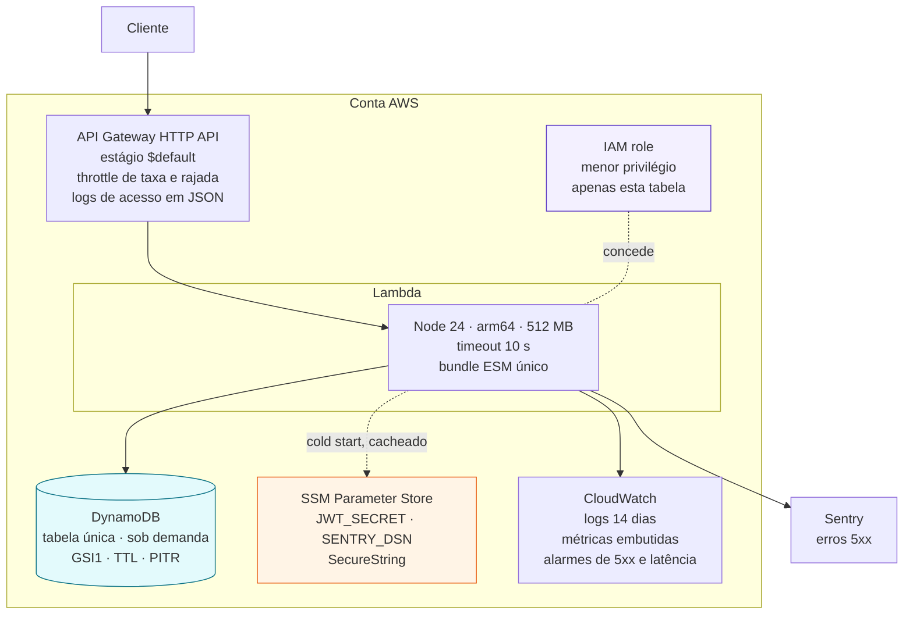

# Infraestrutura na AWS

Tudo provisionado por Terraform, sem passo manual além de `terraform apply` e da
carga inicial de dados. Ver [ADR 0008](../adr/0008-lambda-em-vez-de-fargate.md)
para a comparação com ECS Fargate.

O ponto de atenção operacional está nos segredos: eles são lidos do Parameter
Store **uma vez por instância**, no cold start, e reaproveitados entre
invocações. Ler a cada requisição colocaria a latência do SSM dentro do p99 de
toda chamada.

## Permissões concedidas à função

| Ação                                                 | Recurso                     | Por quê                             |
| ---------------------------------------------------- | --------------------------- | ----------------------------------- |
| `dynamodb:Query`, `GetItem`, `PutItem`, `UpdateItem` | apenas a tabela e o `GSI1`  | operações de leitura e escrita      |
| `dynamodb:BatchWriteItem`, `TransactWriteItems`      | apenas a tabela             | revogação de família de tokens      |
| `dynamodb:DescribeTable`                             | apenas a tabela             | verificação de prontidão (`/ready`) |
| `ssm:GetParameter`, `kms:Decrypt`                    | apenas os parâmetros da app | leitura dos segredos no cold start  |
| `logs:CreateLogStream`, `logs:PutLogEvents`          | apenas o grupo da função    | log estruturado                     |

Nenhuma declaração usa `*` em recurso ou em ação.
