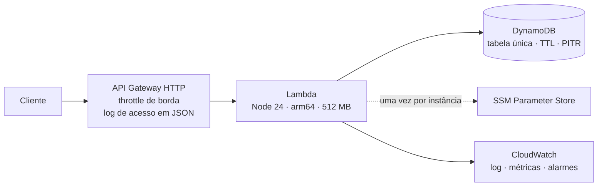

# Infraestrutura

API Gateway HTTP à frente de uma função Lambda em arm64, com DynamoDB como banco
e segredos no Parameter Store. Tudo por Terraform, sem passo manual além da
carga inicial.



## Antes de começar

Credenciais da AWS configuradas, Terraform 1.6 ou mais novo, e Node 24.

```bash
aws sts get-caller-identity   # confirma em qual conta você vai provisionar
```

## Passo a passo

```bash
# 1. Empacota a função.
#    Resolve para linux/arm64 tudo que não cabe no bundle — inclusive o binário
#    nativo do argon2 — mesmo que você esteja em macOS, e falha se algum pacote
#    que o bundle importa não entrar no artefato.
npm run package:lambda

# 1b. Prova que o artefato sobe: roda no runtime oficial do Lambda e exige um
#     200 real em /health. Precisa de Docker.
npm run verify:lambda

# 2. Provisiona.
cd infra/envs/dev
export TF_VAR_jwt_secret=$(openssl rand -base64 48)
terraform init
terraform apply

# 3. Carrega os dados. Idempotente: repetir depois de uma falha não duplica.
cd ../../..
TABLE_NAME=$(terraform -chdir=infra/envs/dev output -raw table_name) \
PERSISTENCE=dynamodb \
JWT_SECRET=$TF_VAR_jwt_secret \
npm run db:seed
```

## Pelo GitHub Actions

O fluxo `Deploy` faz os mesmos três passos acima, por `workflow_dispatch`, num
executor `arm64` — a arquitetura da função, para que o artefato publicado seja o
mesmo que a verificação subiu.

O environment `dev` do repositório precisa de:

| Onde             | Nome                  | Obrigatório | Para quê                                                       |
| ---------------- | --------------------- | ----------- | -------------------------------------------------------------- |
| Variável do repo | `AWS_DEPLOY_ROLE_ARN` | **sim**     | Role assumida por OIDC. Vazia, o fluxo se declara indisponível |
| Variável do repo | `AWS_REGION`          | **sim**     | Região de destino                                              |
| Secret           | `JWT_SECRET`          | **sim**     | Vira o parâmetro cifrado no SSM. Mínimo de 32 caracteres       |
| Secret           | `SENTRY_DSN`          | não         | Ausente desliga o Sentry, sem criar o parâmetro                |

O `JWT_SECRET` é conferido no primeiro passo, antes de qualquer chamada à AWS:
sem ele o Terraform pediria o valor pela entrada padrão e travaria até o
timeout. `TABLE_NAME` **não** é configurável — a carga inicial lê o nome do
output do Terraform, para que não existam duas fontes de verdade.

Trocar o `JWT_SECRET` é uma rotação disruptiva: ela invalida todos os access
tokens e **também todos os cursores de paginação** em circulação, porque a mesma
chave deriva o AES-GCM do cursor.

O `APP_VERSION` da função publicada recebe o SHA do commit, o que faz o `/health`
responder qual código está no ar e o Sentry agrupar eventos por release.

> **Uma execução só.** O estado do Terraform é local (veja
> [Estado remoto](#estado-remoto)) e o runner é efêmero: o segundo disparo do
> fluxo começa sem estado, tenta criar de novo o que já existe e falha. Enquanto
> o backend remoto não entrar, trate o deploy automatizado como provisionamento
> inicial, e faça as reaplicações da máquina de quem opera.

## Conferindo

```bash
API=$(terraform -chdir=infra/envs/dev output -raw api_url)

curl -s "$API/health"   # {"status":"ok",...}
curl -s "$API/ready"    # {"status":"ready"} — prova que o IAM tem DescribeTable

TOKENS=$(curl -s -X POST "$API/v1/auth/login" \
  -H 'content-type: application/json' \
  -d '{"email":"demo@ton.com.br","password":"Desafio@Ton2026"}')

ACCESS=$(echo "$TOKENS" | sed -n 's/.*"accessToken":"\([^"]*\)".*/\1/p')
curl -s "$API/v1/products?limit=5" -H "authorization: Bearer $ACCESS"
```

O `/ready` merece atenção: ele consulta a tabela, então um 200 ali é a prova de
que a política de acesso inclui `DescribeTable`. Sem essa permissão a aplicação
sobe, o `/health` responde, e só o `/ready` denuncia — foi por isso que ele
entrou.

## O que foi provisionado

| Recurso                | Por que assim                                                                                  |
| ---------------------- | ---------------------------------------------------------------------------------------------- |
| DynamoDB, tabela única | Cobrança sob demanda, TTL para expurgo, recuperação para qualquer instante dos últimos 35 dias |
| Lambda arm64, 512 MB   | Custa menos por milissegundo; a memória é ditada pelo argon2, que usa 19 MiB por verificação   |
| API Gateway HTTP       | Um terço do preço da REST, e traz o que este projeto usa                                       |
| Parameter Store        | Segredo cifrado, lido uma vez por instância, nunca por requisição                              |
| CloudWatch             | Log com retenção explícita, métricas embutidas e três alarmes                                  |

## Permissões da função

Nenhuma declaração usa `*` em recurso ou em ação.

| Ação                                                 | Recurso                    | Para quê                                              |
| ---------------------------------------------------- | -------------------------- | ----------------------------------------------------- |
| `dynamodb:Query`, `GetItem`, `PutItem`, `UpdateItem` | tabela e índices           | Leitura e escrita da aplicação                        |
| `dynamodb:BatchWriteItem`, `TransactWriteItems`      | tabela                     | Revogação de família e rotação de refresh token       |
| `dynamodb:DescribeTable`                             | tabela                     | Sonda de prontidão                                    |
| `ssm:GetParameter`, `GetParameters`                  | parâmetros desta aplicação | Segredos no carregamento                              |
| `kms:Decrypt`                                        | chave gerenciada do SSM    | Abrir os parâmetros cifrados, restrito ao uso via SSM |
| `logs:CreateLogStream`, `PutLogEvents`               | grupo desta função         | Log estruturado                                       |

## Custo

Dentro do nível gratuito para uso de avaliação, e próximo de zero em repouso:
DynamoDB sob demanda e Lambda não cobram por tempo ocioso. O que gera custo fixo
é apenas a retenção de log, de 14 dias.

## Limpando

```bash
terraform -chdir=infra/envs/dev destroy
```

Em `dev` a proteção contra remoção fica desligada de propósito, para que isso
funcione. Em produção ela é ligada, e a tabela precisa ser desprotegida à mão —
o atrito é o ponto.

## Estado remoto

O bloco de backend em `envs/dev/main.tf` está comentado. Quem avalia este
projeto não tem o bucket, e um backend inexistente impede até o `terraform
init`; com estado local, tudo funciona em qualquer conta.

Em uso compartilhado de verdade, descomente. Sem estado remoto e sem trava, duas
pessoas aplicando ao mesmo tempo corrompem o registro do que existe.

Vale saber: o valor do segredo **fica no arquivo de estado**, mesmo sendo
gravado cifrado no Parameter Store. É por isso que o backend precisa de cifra e
de acesso restrito.

## O que não foi executado

`terraform apply` não foi rodado: não há conta AWS neste ambiente. O fluxo
`Deploy` também não foi disparado ponta a ponta, pela mesma razão — o que se
corrigiu nele foi a ausência do empacotamento e das variáveis obrigatórias, e
isso se confere lendo o workflow, não uma execução verde. O que foi verificado
de fato:

- `terraform fmt -check` e `terraform validate` passam em cada um dos cinco
  módulos, isoladamente, como o CI faz.
- O artefato do Lambda contém o binário do argon2 para `linux-arm64-gnu`, e ele
  **carrega e verifica senha** dentro de um contêiner `linux/arm64` — que era o
  risco registrado no ADR 0007.
- O empacotamento falha, em vez de gerar artefato incompleto, quando um pacote
  importado pelo bundle não entra no artefato.
- O artefato **sobe e responde 200 em `/health`** dentro da imagem oficial
  `public.ecr.aws/lambda/nodejs:24` em `arm64`, com a documentação ligada e
  desligada (`npm run verify:lambda`).
